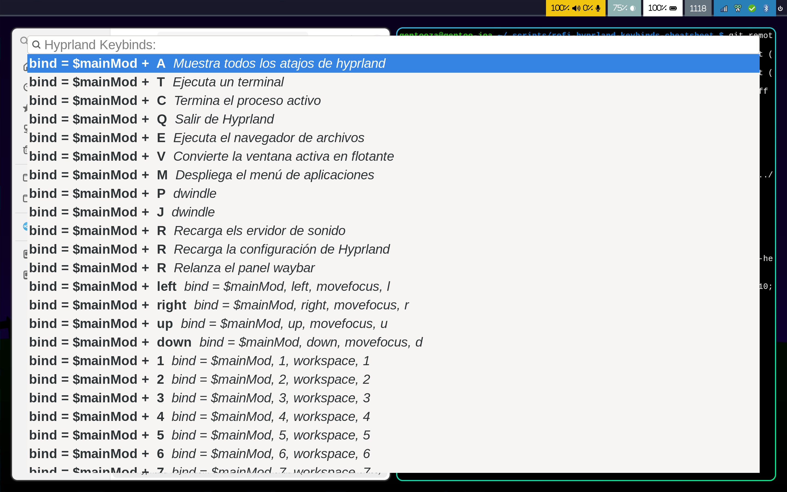

# Wofi-hyprland-keybinds-cheatsheet

This script provides a quick and efficient way for Hyprland users to access and execute keybindings defined in their Hyprland configuration file. By leveraging the power of Wofi, this tool presents a user-friendly interface to browse and activate various system commands and shortcuts, streamlining the user experience on Hyprland.

# Main differences with: Rofi-hyprland-keybinds-cheatsheet

+ It uses Wofi for a pure Wayland environment.
+ It maximizes the Wofi window with the keybindings
+ It shows only basic information of every keybinding
+ ... 

## Preview




## Prerequisites

- **Hyprland**: You must have Hyprland installed and properly configured on your system.
- **Wofi**: This script utilizes Rofi to display the keybindings menu. Ensure Wofi is installed before using this script.

## Installation

1. **Download the Script**: Clone this repository or download the script directly to your local machine.
2. **Make the Script Executable**: Change the script's permissions to make it executable by running:

    ```bash
    chmod +x rofi_keybinds.sh
    ```

3. **Configure Hyprland**: Make sure your Hyprland configuration file (`~/.config/hypr/hyprland.conf`) includes the keybindings you intend to use.
    ```
    $mod=SUPER
    bind=$mod, A, exec, ~/path/to/script/rofi_keybinds.sh               # Show all keybinding
    ```

---

## License

[MIT License](LICENSE)
